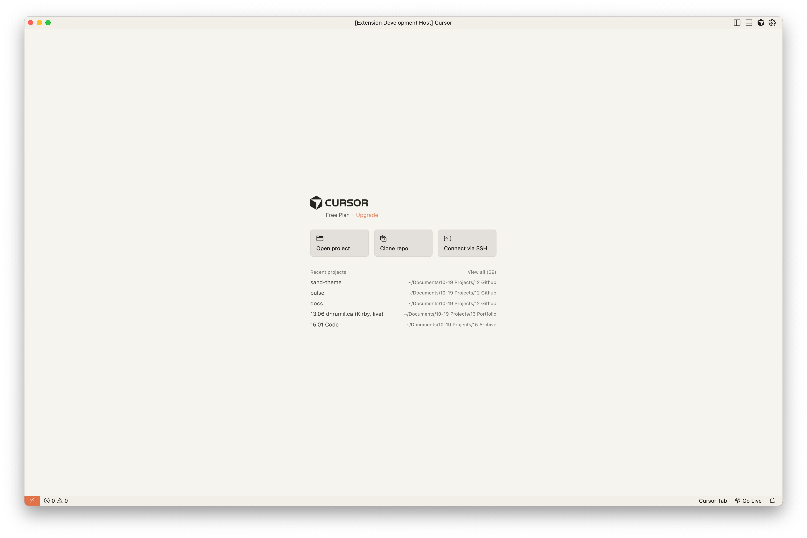
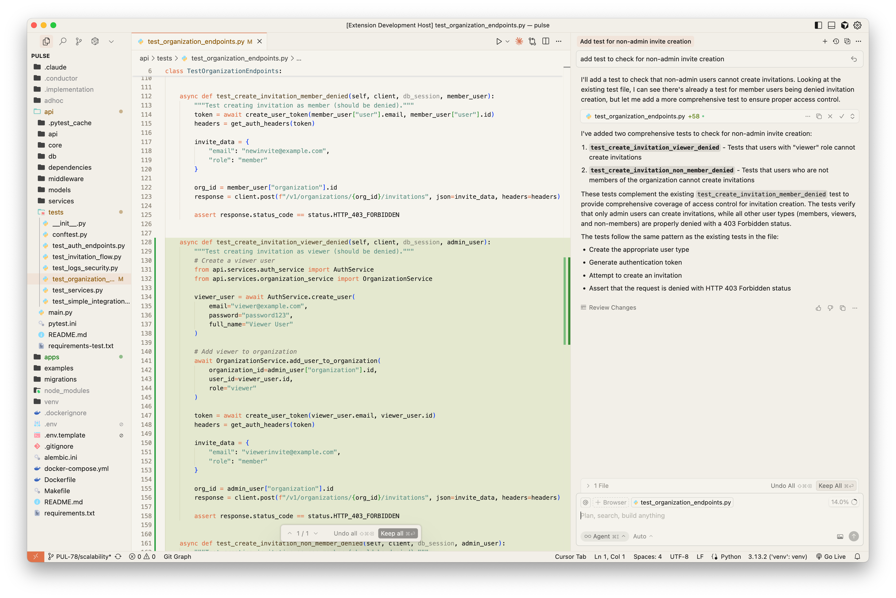

# Sand (Light) Theme

A warm, minimal light theme for Visual Studio Code inspired by Anthropic's design palette featuring sand and clay colors.

## Features

- **Warm sand backgrounds** that are easy on the eyes
- **Clay accent colors** for highlights and selections  
- **Excellent readability** with carefully chosen contrast ratios
- **Minimal design** that doesn't distract from your code
- **Light theme** perfect for daytime coding

## Installation

### Via VS Code Marketplace

1. Open VS Code
2. Go to Extensions (Ctrl+Shift+X / Cmd+Shift+X)
3. Search for "Sand (Light)"
4. Click Install
5. Go to File > Preferences > Color Theme and select "Sand (Light)"

### Manual Installation

1. Download the latest release from [GitHub](https://github.com/dhrumilcse/sand-theme)
2. Copy the theme to your VS Code extensions folder
3. Reload VS Code
4. Select the theme from Color Theme preferences

## Screenshots

The theme features a warm, sand-colored background with carefully selected colors for syntax highlighting that provide excellent readability while maintaining a minimal aesthetic.

## Color Palette

- **Background**: `#F6F4EE` (warm sand)
- **Foreground**: `#1A1A1A` (near black)
- **Accent**: `#E0734A` (clay orange)
- **Comments**: `#7B776F` (muted brown)
- **Strings**: `#67978A` (sage green)
- **Keywords**: `#E0734A` (clay orange)

## Contributing

Issues and pull requests are welcome! Please visit the [GitHub repository](https://github.com/dhrumil/sand-theme).

## License

This theme is licensed under the [MIT License](LICENSE).
